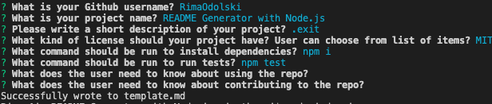

# README Generator with Node.js 

# USER STORY 
 AS A developer

I WANT a README generator

SO THAT I can easily put together a good README for a new project

# DESCRIPTION 

 In this project, we create a command-line application that dynamically generates a README.md from a user's input. The application will be invoked with the following command: 
  node index.js
  
 The generated page is titled template.md
  ### The generated README includes the following sections:
  * Title

  * Description

  * Table of Contents
  * Installation
  * Usage
  * License
  * Contributing
  * Tests
  * Questions
  * User GitHub profile picture
  * The generated README includes 1 badge that's specific to the repository.

### Use github user API to retrieve profile picture
https://api.github.com/users/<username_goes_here>

